# Robot Simulators

Notes on the availability of robot simulators that might be appropriate for revised activities in the *TM129 Robotics* block.

A key consideration are the learning objectives surrounding that we require the practical activities to meet. 

Currently (up to and including 19J), TM129 Robotics block practical activities cover teaching elementary programming in the context of a simple 2D simulator, and training a simple neural network via an application with a graphical user interface.

More generally, learning objectives for the update might include, but not be limited to:

- teaching basic programming *in general*;
- teaching some principles of *robot programming*;
- demonstrating how simulations can be used to design and test robot control programmes;
- limitations of simulation compared to real world operation;
- an example of how virtualisation can be used to support the distribution of, or access to, complex or resource hungry software environments.

With proposed updates to the TM129 Robotics block also suggesting an increased coverage of various AI related topics, potentially including smart systems and conversational agents, we might also be tempted to include:

- teaching basic programming around smart devices and smart sensors;
- teching basic programming around conversational interactions (eg chatbots, smart speaker skills).


## Strategic concerns

If other modules across the OU, such as in the Engineering programme, are likely to require the use of a physical world simulator, then it might make sense for TM129 to pick a simulator that would be appropriate for use in such courses.

This would allow OU educators and developers to gain familiarity in use of the simulator and its deployment. Use across several modules also provides support for developing OU customisations (branding, improving student experience, etc).

## Deployment Concerns

Making software applications available to OU students, who work at a distance on computers outside of our control, is often challenging.

The OU policy is that students should have a minimum specification computer (which is set at a very low spacification) and minimum version operating system (which may be very old, and even past its support date) although which operating system is left open; students could use Windows, Mac O/S, Linux, so cross-platform support is required.

The computer specification does not admit of tablets, phones or netbooks/Chromebooks, although increasingly these may be the only computer the student has access to (in particular, netbooks/Chromebooks).

Selecting software that runs an HTML over HTTP user interface means that the student only requires a web browser to run software, although some clients may specify particular browsers (such as a recent version of Chrome or Firefox). Desktop applications without an HTML UI can also be accessed via a browser using no-vnc or XPRA web-browser clients, or via cross-platform RDP clients.

Cross-platform support can conveniently be provided using virtualised applications (OU modules have distributed software to students using both VirtualBox virtual machines and Docker containers) to allow offline running of module software and local file persistence. This has the advantage that the same application software and software environment is provided to all students.

Some robot simulators are resource intensive, requiring large amounts of memory, particular graphics cards, or GPUs. Application image sizes may also be large, particularly for virtualised applications, requiring a large amount of free disk space prior to installation. (Experience suggests that some students have very little free disk space on their computers.)

Virtualised environments can be made available to students remotely as well as locally on their own machine (the *same* environment applying inseide the VM in each case). Whilst this does require students to have an internet connection to the remote application server, their computer only needs to support an internet browser (which means activities could also be completed using netbooks, tablets, or even phones). Challenges to the OU of providing remote access include managing multi-user access and authentication, student personal file persistence and peak load resource provisioning.

TM112 has recently experimented with hosting a scaleable multi-user JupyterHub service accessed via a VLE module website to deliver a temporary Jupyter notebook activity to students. Students can run activities during a single online session but not save those activities to return to them later. It is quite possible to configure the JupyterHub server to provide persistent student accounts, although this requires additional storage resource. [Currently, there is no precedent for this mode of operation within the OU although many other institutions do offer this sort of personalised service.] The TM112 JupyterHub service serves a potentially user-selectable container instance to a connected user via a scaleable Kubernetes backend. As well as running a Jupyter notebook server UI, the notebook server can proxy other HTTP/HTML user interfaces (for example, running [RStudio via a proxy](https://github.com/jupyterhub/jupyter-rsession-proxy)), including remote desktops exposed via no-vnc (for example, [`jupyter-desktop`](https://github.com/yuvipanda/jupyter-desktop)). JupyterHub can thus be used to provide authenticated multi-user access to arbitrary, personal, containerised applications other than Jupyter notebooks, albeit proxied by the personal notebook server running in the container.


## TM129 Practicals, <= 19J

TM129 provides practical experience in simple robot programming using the `RobotLab` 2D simulator, originally developed for T184.

The `RobotLab` simulator provides a text based drag and drop or click-to-insert interface that allows syntactically correct text programmes to be developed through interactions with a text command palette.


Programmes are used to control a simple differential drive robot, with trace, in a graphical 2D simulator. Programmes may be run to completion or stepped through a line at a time.

As well as providing a simple simulation environment, `RobotLab` could also control a physical Lego robot via the Lego Mindstorms RCX brick, providing students who had access to such a robot with the ability to run their programs in both the provided simulator and on their own robot.

`RobotLab` was originally built as a Windows desktop application. Cross-platform support is currently provided using *PlayOnMac* and *Wine* runtimes. Experimental support for virtualised distribution locally or via a remote websrvice has also been explored.

A simple graphical neural network application, `Neural`, originally developed as a Windows application for a module prior even to T184, is also currently used on TM129. `Neural` provides a graphical user interface for training simple, customisable neural networks.

## Updating TM129 Practical Activities

The proposed revisions to TM129 place an increased emphasis on AI and modern machine learning architectures. Trends in robotics research and development also demonstrate increased reliance on the use of powerful simulations during the development and testing of robotic systems.

`RobotLab` has aged well as a simple and effective instructional programming environment in terms of its user interface design. However, providing ongoing support of this 20 year old application is increasingly an issue, although virtualised offerings might be able mitigate against student software installation issues.

The planned revision of TM129 provides an opportunity to overhaul the practical activities in the robotics module. There are several avenues we might explore when choosing applications or environments to replace the original `RobotLab` and `Neural` applications:

- demonstrating the use of powerful 3D simulators that might be used in other modules in the engineering and science qualification pathways, including project modules and Masters level modules;
- demonstrating the remote hosting and delivery to students of web applications with computing requirements that exceed the OU minimum specification computing requirements (for example, in terms of memory, GPU requirement, etc). (The in-production module *TM358 Machine Learning* is likely to have a GPU requirement for training deep learning models.)
- using open source environments that are used in other modules and as such contribute additional development and support focussed resource into any required necessary customisations, particularly on grounds of accessibility, branding, etc.

Note that when considering environments, we require three components:

1. A `programming environment` for programming simulated robots;
2. A `programming language` that can be used within the `programming environment` and that can control simulated robots in the `simulation environment`;
3. A `simulation environment` for visualising the effect of programmed control of simulated robots.

In some cases, the same application may meet *all three* requirements in a tightly coupled / integrated way. In others, it may be possible to decouple the programming environment and language from the simulation environment, or loosely embed a simulation environment within the context of the programming environment.

If the module revisions extends to practical activities that include programming conversational agents, it would be useful same programing environment could be used to programme the robot simulator as well as the conversational agents.

## Software Applications - General Criteria

The simulators and development environments were identified on the basis of web searches for applications that meet one or more of the following criteria:

- open source [`REQUIRED`]
- Python code base [`DESIRABLE`]
- browser based UI (supports web delivery) [`DESIRABLE`]
- cross-platform support (for software distributed to students, this is [`REQUIRED`]; for software delivered remotely via a web UI or RDP, this is [`OPTIONAL`])
- runs on OU min spec computers (for software distributed to students, this is [`REQUIRED`]; for software delivered remotely via a web UI or RDP, this is [`OPTIONAL`])
- interoperable simulator and programming environments [`REQUIRED`]
- support for simulated robot models that correspond to real world robots that could be controlled directly in the real world rather than just in the simulator [`DESIRABLE`]
- support for simulated models of Lego EV3 (as used in OU residential school activities) and Baxter robots (as available in the Remote STEM Lab) [`DESIRABLE`]

Suggestions regarding other openly available programming environments and simulators are welcome.

## Robot Simulators Review

The following (brief) review is not necessarily comprehensive.

*Suggestions for alternative applications / environments are welcome.*

### Python Turtle / ipyturtle

The Python programming language comes with an implementation of a 2D turtle, often used to to teach elementary programming. (Indeed, a python turtle is used to introduce Python programming in TM112.)

The native Python turtle runs in a pop-up Tk window although python packages to provide a turtle canvas in Jupyter notebooks ([`ipython-turtle-widget`](https://github.com/gkvoelkl/ipython-turtle-widget)) and JupyterLab ([`jupyterlab-turtlegraphics`](https://github.com/dirkcgrunwald/jupyterlab-turtlegraphics), although not (yet?) supported for recent versions of JupyterLab).

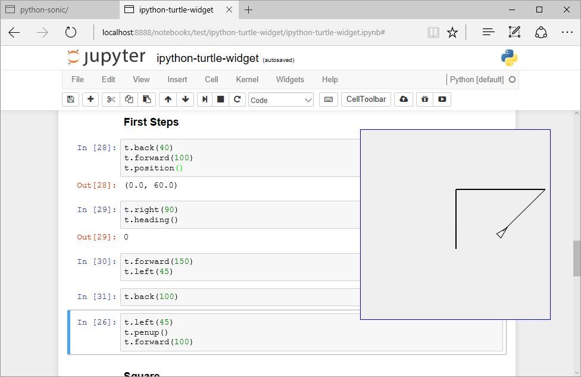

A demo script for the `ipyturtle` widget can be found [here](https://github.com/ouseful-demos/simple-robot-simulator-review/blob/master/demos/ipyturtle_demo.ipynb) and tried here: [](https://mybinder.org/v2/gh/ouseful-demos/simple-robot-simulator-review/master?filepath=demos/ipyturtle_demo.ipynb)

Whilst turtles can be used to teach simple open loop styling programming, there is no sensory feedback so sensor mediated closed loop control within a simulated environment is not possible.

However, a turtle environment may be appropriate as an engagement tool for TM129, introducing students to the idea of controlling a turtle through simple motor commands and then teasing: "but what if the turtle could also *sense* its environment and act accordingly?"

### Open RobertaLab

*Open RobertaLab*  is a blocky style graphical interface that can be used to programme several robot types and simple electronics development boards. An in-built 2D simulator is provided for some of the robot models, including the Lego EV3.

*Open RobertaLab* is accessed via a web browser and runs as an online hosted environment. You can [try *Open RobertaLab* online here](https://lab.open-roberta.org/).

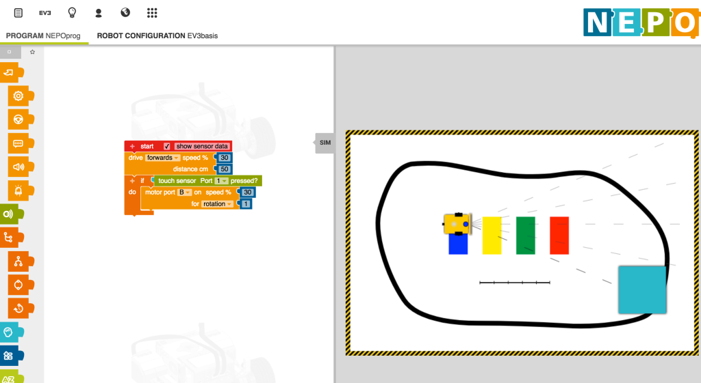

There is the ability to look at Python script generated from the blocks view, although not edit it.

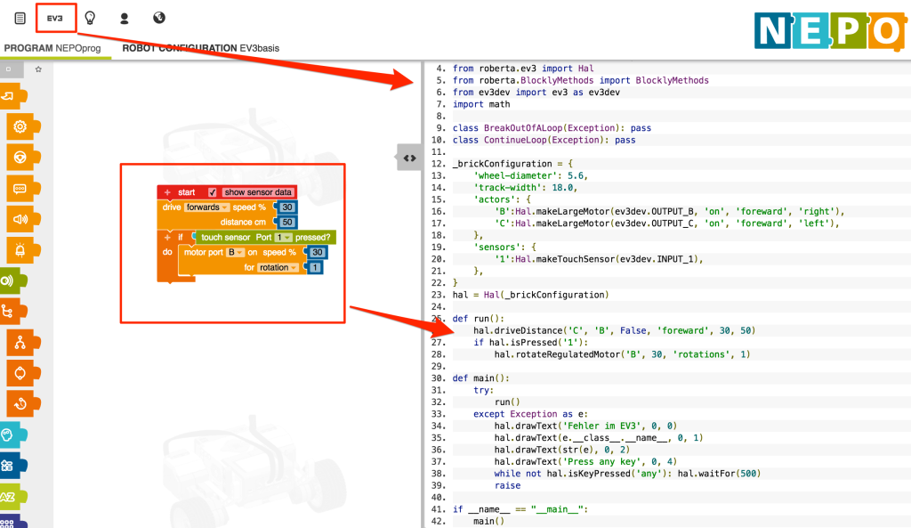

Available sensor types in the RoboSim (EV3basis) include a touch sensor, ultrasound (distance) sensor, colour sensor, infrared sensor (distance, presence), gyroscope and timer. Sensor types and motors are configurable.

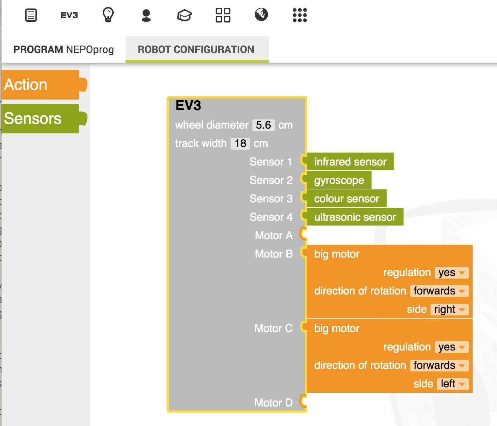

Several simulator environments are provided as default, and custom simulator environments can be created, Environments can include coloured traces on the simulator floor and objects in the plane of the robot sensors that are sensed by the ultrasound sensor, for example.

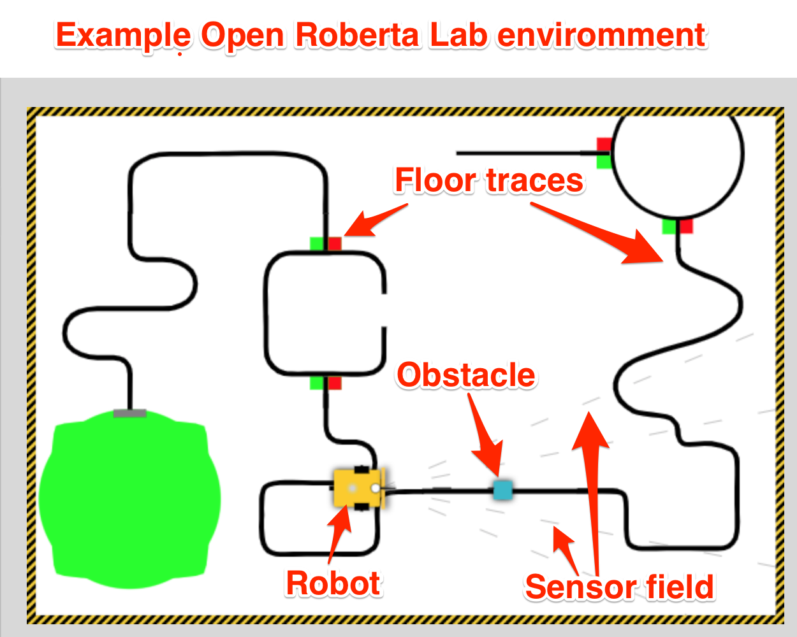

The code is openly licensed [[repo](https://github.com/OpenRoberta/openroberta-lab)] and could be hosted institutionally, or students could download it and run it themselves, for example via a containerised application.

You can try it out here: [Open Roberta Lab online](https://lab.open-roberta.org/).

You can run a local version of *Open RobertaLab* under Docker using the following command:

`docker run --rm -d  -p 1999:1999 --name robertalab_demo ousefuldemos/robertalab`

The service will be available on `localhost:1999`.

An OU fork of the blockly style *Scratch* environment (*OU Build*) is already being used in one of the new first level courses to introduce basic programming, so the blocks style environment is one that students will see elsewhere, albeit in a rather simplistic fashion.

__Advantages:__ simple 2D simulator has much of the feel of RobotLearn; converting current RobotLab activities to Open Roberta Lab activities should in large part be possible; browser based; more senosrs available for use in simulator than RobotLab.

__Disadvantages__: accessibility may be an issue; blocks editor does not allow text-based programming / editing, although inpsection of autmoatically generated equivalent code is possible.

TO DO - mention of the other dev boards Open Roberta Lab supports

__Key Considerations__: cross-platform local delivery possible via Docker container;

__TO CHECK__: can you code step through code one block at a time? Is there a data logger / data display? Can the service be proxied through jupyter-server-proxy? If so, multi-user access via VLE auth and JupyterHub would be possible.

### Jyro

`Jyro` ([docs](https://jyro.readthedocs.io/en/latest/), [code](https://github.com/Calysto/jyro)) is a simple 2D robot simulator, with a 3D camera view, created by Doug Blank whilst at Bryn Mawr College, implemented in Python. Jyro is desgined to work within Jupyter notebooks (although not currently in JupyterLab).

The base simulated robot is based on a Pioneer differential drive robot. It can be configured with ultrasound sensors around the robot, a forward facing camera and forward facing light sensors.

A gripper can also be attached to the robot, and a class exists to define a puck that can presumably be collected by the robot, but I haven't yet managed to find a demo of this working or create one myself.

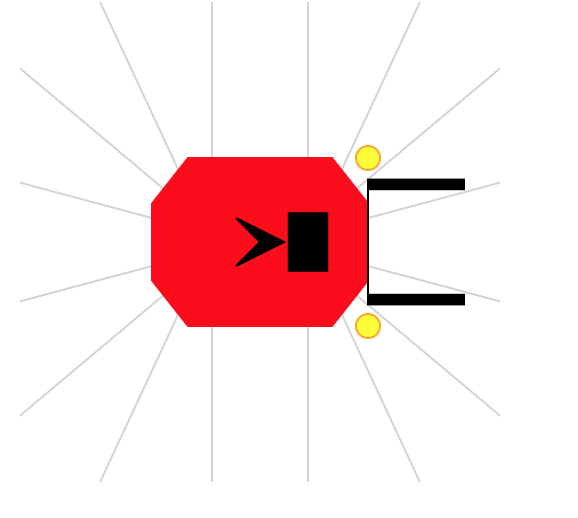

The world is defined as a wall bounded square area with user-defined floow and wall coours, containing user defined coloured boxes of arbitrary size.

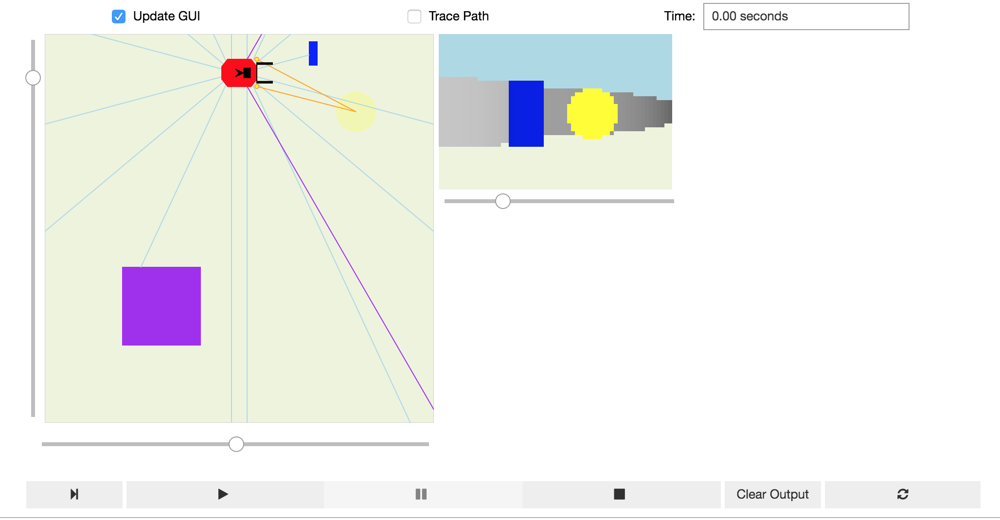

Lines and other coloured markers cannot be placed on the floor of the simulator (this would presumably complicate the robot's  camera view of the world), nor is there currently support for a downward facing light sensor. It might be possible to contive a downward facing light sensor that can be seen in the plan view of the world, and from a downward facing light sensor, but mask this from the 3D camera view.

When a control programme is associated with the `.brain` of the robot and the simulator play button pressed, the simulator loop runs and the robot behaves in accord with its programmed actions.

The following programme fragment demonstrates a simple control programme with data logging into a `pandas` dataframe enabled. The simulator runs in its own control loop inside a widget, with the robot's state mirrored in the notebook kernel. This means that robot sensor data can be collected from the simulator widget and displayed within the notebook, even as the simulator is running.

```python
import pandas as pd

df_log = pd.DataFrame()

def avoidObstacleLogged(robot):
    """ Turn right if there's an obstacle close ahead, else go straight. """
    global df_log
    
    sonars = robot["sonar"].getData()
    front = min(sonars[1:7])
    if front < 0.5:           # check for an obstacle
        robot.move(0.0, -1.0) # stop and turn right
        df_log = df_log.append({'dist':front, 'action':'turn'}, ignore_index=True, sort=True)
    else:
        robot.move(1.0, 0)    # otherwise go straight
        df_log = df_log.append({'dist':front, 'action':'straight'}, ignore_index=True, sort=True)
        
robot.brain = avoidObstacleLogged
```

It would be useful to explore the extent to which a straming dataframes and/or streaming charts mught be able to display sensor data in real time as it runs.

Another avenue to explore would be the use of Voilà style dashboards to display simulator and live telemetry chart views over predefined worlds and robot control programs.

A "headless" simulator is also available for running multiple experiments in the same world in order to collect data.

A demo script for the  `Jyro` simulator can be found [here](https://github.com/ouseful-demos/simple-robot-simulator-review/blob/master/demos/Jyro_demo.ipynb) and tried here: [](https://mybinder.org/v2/gh/ouseful-demos/simple-robot-simulator-review/master?filepath=demos/Jyro_demo.ipynb)

__Advantages__: Python, visual simulator, good Jupyter notebook integration, user-definable world, configurable robot with useful sensors, simple world physics, datalogging ability.

__Disadvantages__: can lose sight of visual simulator when scrolling notebook; no floor marks or sensing of floor marks; default `.move` semantics take some thinking about when applied together. No code stepper (not sure how that would/could be managed?)

__To explore:__ potential for mutlirobot and/or puck moving activities? Streaming data log charts? Getting the robot to speak.


## [Jyro] Robot Simulator in Java / Processing

A port (I think?) of the Jyro simulator to Java / Processing, again by Doug Blank (via an example [here](https://jupyter.brynmawr.edu/services/public/dblank/CS110%20Intro%20to%20Computing/2017-Spring/Lectures/Robot%20Control.ipynb)).

The simulator works in a Jupyter notebook running a `processing` kernel.

As with Jyro, worlds can be configured and rendered in a notebook output cell. Once again, a plan view and a robot's POV are displayed in the simulator.

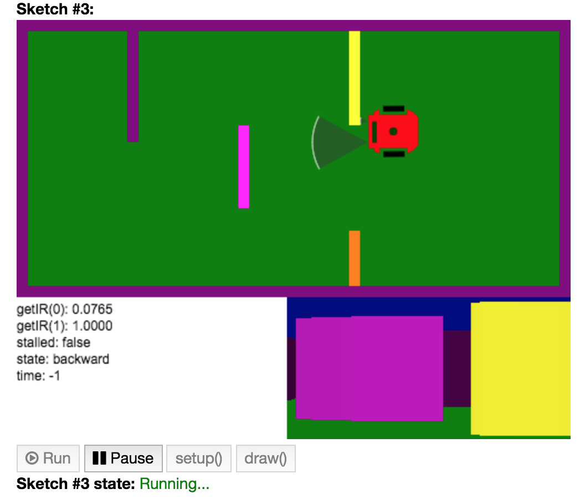

A text area display within the simulator view can be scripted via the robot definition.

The robot is programmed by subclassing a `Robot` class and adding a `brain()`...


```java
class MyRobot extends Robot {
    MyRobot(float x, float y, float r) {
        super(x, y, r);
        this.state = "start turn left";
    }

    void brain() {
        PImage pic = this.takePicture();
        // Show pic on canvas:
        image(pic, 500 - 256, 250);
        fill(0);
        text("getIR(0): " + nf(this.getIR(0), 1, 4), 0, 265);
        text("getIR(1): " + nf(this.getIR(1), 1, 4), 0, 280);
        text("stalled: " + this.stalled, 0, 295);
        text("state: " + this.state, 0, 310);
        text("time: " + this.time, 0, 325);
        
        // brain:
        
        float speed = 3.0;
        if (this.state == "backward") {
            if (this.stalled) {
                this.state = "forward";
                this.forward(speed);
            } else {
                this.backward(speed);
            }
        } else if (this.state == "forward") {
            if (this.stalled) {
                this.state = "backward";
                this.backward(speed);
            } else {
                this.forward(speed);
            }
        } else if (this.state == "start turn left") {
            this.time = 62;
            this.state = "turn left";
        } else if (this.state == "turn left") {
            if (this.time < 0) {
                this.turn(0);
                this.state = "forward";
            } else {
                this.turn(.05);
                this.time -= 1;
            }
        } else if (this.state == "turn right") {
            this.turn(-.05);
        } else if (this.state == "stop") {
            //this.stop();
        }
    }
}
```

The `move` command semantics resemble those of Jyro (forward/backward translation and a turn component) although managed slightly differently in example programmes by specifying a natual language move `state` and then implementing motion commands via `.forward()`, `.backward()` and `.turn()` methods.

__Advantages__: runs in a Jupyter notebook with an appropriate kernel; the simulator feels a bit more fluid in the way it renders the world than the original *Jyro* simulator. The availability of processing means that extending graphics / animation features is probably ripe for possibilities.

__Disadvantages__: Java...

A demo script for the Java/Processing port of the `Jyro` simulator can be found [here](https://github.com/ouseful-demos/simple-robot-simulator-review/blob/master/demos/Jyro_processing_port_demo.ipynb) and tried here: [](https://mybinder.org/v2/gh/ouseful-demos/simple-robot-simulator-review/master?filepath=demos/Jyro_processing_port_demo.ipynb)

### Ev3devSim

*Ev3devSim* [[repo]( https://github.com/QuirkyCort/ev3dev-sim)] is a purely browser based simulator that can be run using a local webserver.

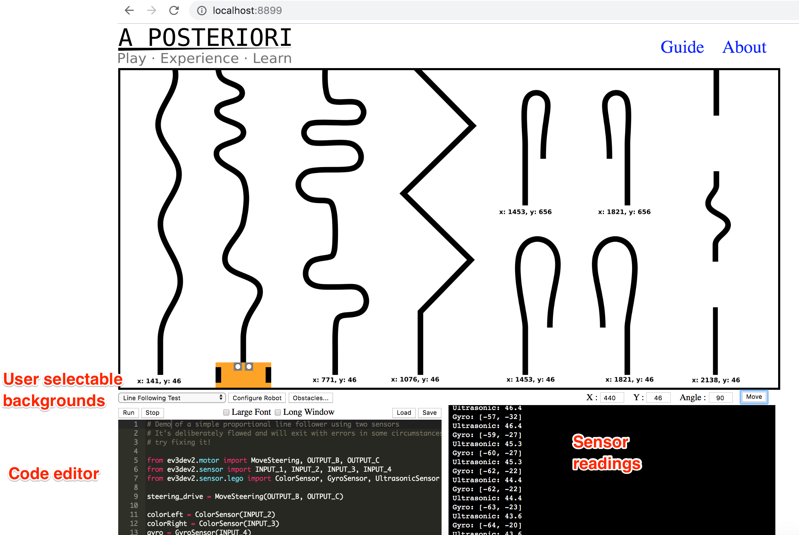

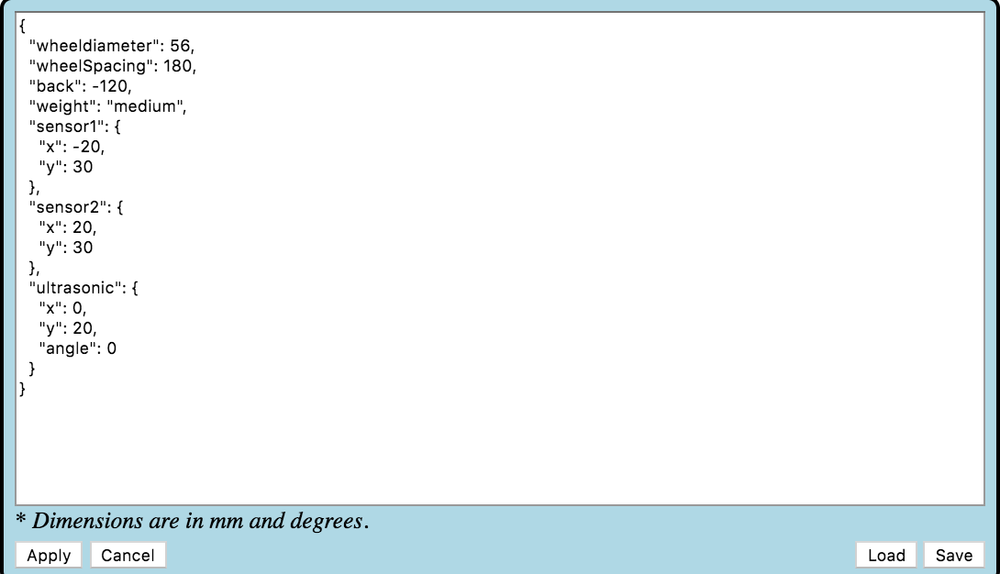


Try out a [live demo here](https://www.aposteriori.com.sg/Ev3devSim/index.html).

The application can also be run within MyBinder proxied via `jupyer-server-proxy` __[demo to follow...]__.


__Advantages__:

__Disadvantages__:

__To explore__: the developers of another blockly style environment, *BlockPy*, are currently developing an editor, [*BlockMirror*](https://github.com/blockpy-edu/BlockMirror) that provides *"[a]n interface for dual block/text representation with Blockly"*. The *BlockMirror* editor embeds the *Skulpt* parser (as does *Ev3devSim*) and allows the user to toggle between block and code views: editing one view is reflected by changes to the other. I wonder how easy it would be to use *BlockMirror* as the editor within *Ev3devSim*? (I have filed an [issue](https://github.com/QuirkyCort/ev3dev-sim/issues/3) to the original `ev3dev-sim` repo related to this.) It should be easy enough to package *Ev3devSim* for cross-platform use as an electron application. I also wonder about how easy it would be to separate out the components of *ev3dev-sim* and run it inside a Jupyter notebook (or JupyterLab) using a [*Skulpt* kernel](https://github.com/Calysto/skulpt_python). Something else that might be worth exploring is whether the simulator could be integrated into BlockPy, allowing that environment to be used for blocks or text based programming in a data or robotics context; the robotics simulator might also provide data for visualising/analysing in the data science context? [Here's a related [issue](https://github.com/blockpy-edu/blockpy/issues/78).]


????Maybe also https://github.com/ev3dev/ev3dev-lang-python/issues/264#issuecomment-530658432

### Webots


Webots is a cross-platform eg https://github.com/cyberbotics/webots


You can try the *Webots* simulator out via the [robotbenchmark](https://robotbenchmark.net/) robot challenge website.


### V-REP

V-REP is a fully featured, cross-platform 3D simulator developed by ???

The VREP simulator comes with a wide range of simualted robot models, from mobile robots to robot arms. A Baxter robot model is also available.

Simulated robots can be programmed natively within the VREP environment using Lua scripts. However, a Python API is also available which allows robots to be scripted using Python code. A ROS interface for programming VREP simulated robots using ROS is also available [although I haven't tried it...]

A set of example materials were produced as part of a previous TM129 update scoping activity and can be found here: [`ou-robotics-vrep`](https://github.com/psychemedia/ou-robotics-vrep/tree/master/robotVM). A VirtualBox virtual machine demo is also available.

In the `ou-robotics-vrep` demo, the simulator is packaged along with a Jupyter notebook server inside a Virtualbox virtual machine. The simulator runs on the VM desktop and controlled via Python programs running inside Jupyer notebooks, access via a browser on host.

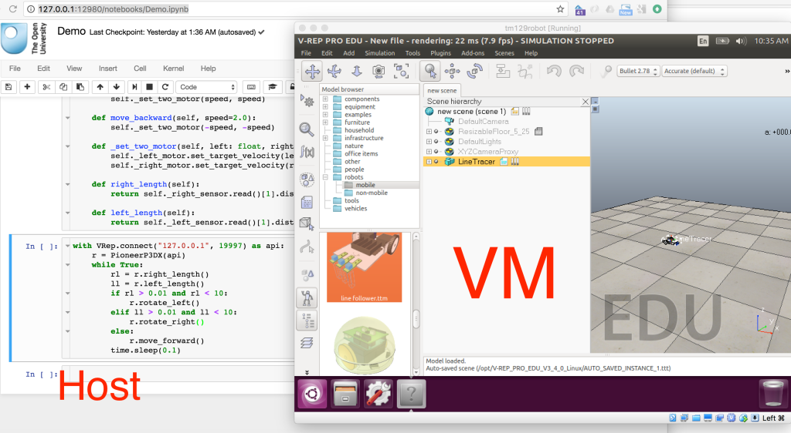

THe VREP simulator can be instrumented within a world scene, or via code. Real time telemetry charts live logged showing sensor readings can be displayed in-world.

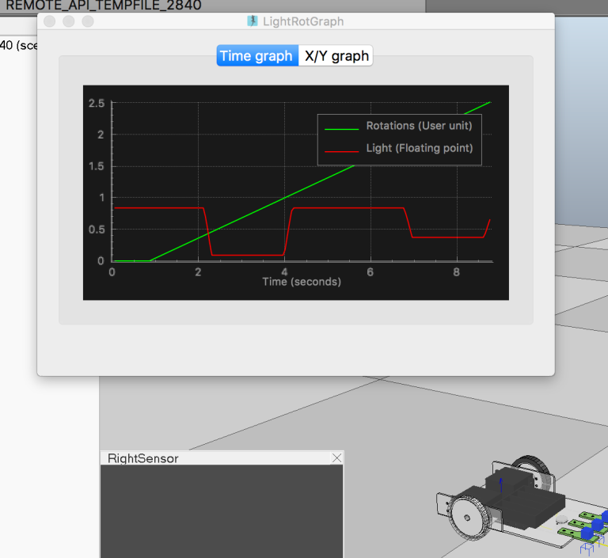

Telemetry data can also be captured into a Jupyter notebook used to control the simulator and and robot operating within it.

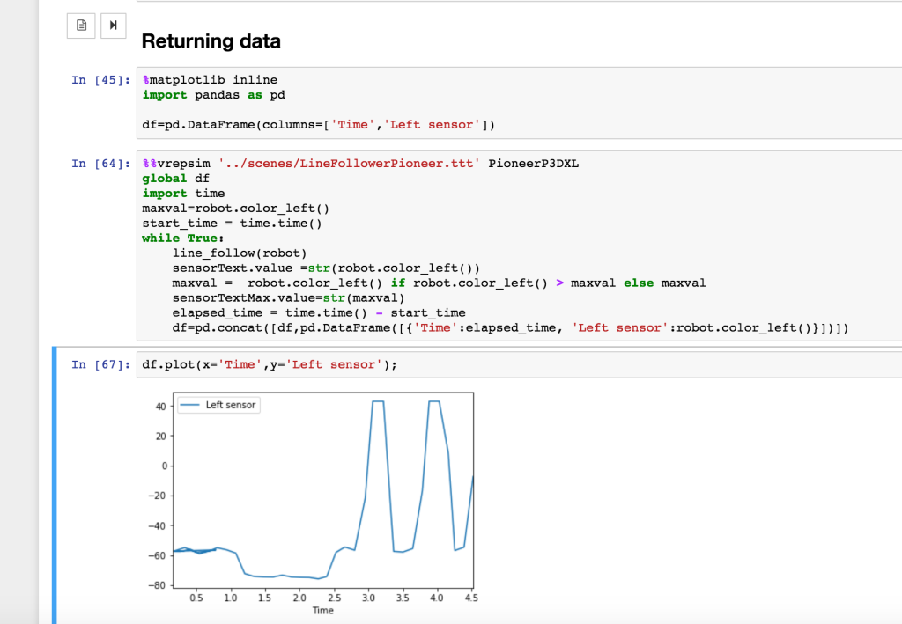

Further context is available in a series of blog posts produced at the time, for example [here](https://blog.ouseful.info/2017/09/10/distributing-virtual-machines-that-include-a-virtual-desktop-to-students-v-rep-jupyter-notebooks/), [here](https://blog.ouseful.info/2017/10/03/ipython-magic-for-v-rep-robot-simulator/) and [here](https://blog.ouseful.info/2017/10/03/first-attempt-at-using-ipywidgets-in-jupyter-notebooks-to-display-v-rep-robot-simulator-telemetry/).

__Advantages__: VREP is a fully featured simulator offering a wide range of robot models. A Python API, as well as a ROS interface, are available.

__Disadvantages__: VREP can be resource hungry and the installation path can be tricky, particular if the programming environment needs to be interfaced with it; this can be simplified by distributing the whole environment via a virtual machine, although performance of the vitualised simulator compared to running it as a native host desktop application may be impaired. [I don't remember if I tried to run it on a powerful server access via RDP? If using RDP, the notebook server could be accessed via a browser installed on the virtual desktop, or as a headless service exposed via another http port.]

### ROS


*ROS*, the *R*obot *O*perating *S*ystem*, 

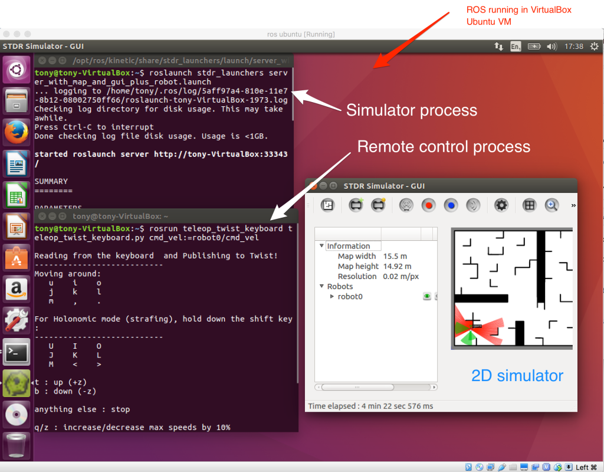


#### Robot Development Studio

https://www.theconstructsim.com/rds-ros-development-studio/

**didn't work for me when I tried - Jupyter kernel kept dying**

#### jupyter-ros

jupyter-ros https://github.com/RoboStack/jupyter-ros


web viz for ros https://webviz.io/ alternative to RViz


Gazebo / ROS eg ?? https://github.com/shadow-robot/ , ??https://github.com/FlorianWilk/ROSStudio
smart_grasping_sandbox


http://lenkaspace.net/tutorials/programming/robotSimulatorsComparison


Amazon Deep Racer

https://medium.com/adventures-in-autonomous-vehicles/introducing-the-f1-10-simulator-b614af2cd652 https://github.com/mlab-upenn/racecar_simulator/tree/master docker https://hub.docker.com/r/billyz/f110sim


## Customising / Forking a Current Environment or Creating a New Bespoke One

An earlier attempt at updating TM129 robotics module commissioned the development of a webservice mediated application with a UI resembling the original RobotLab UI, although I donlt believe this was delivered.


BlockPy does not embed an animated stage canvas (unlike Scratch / OU Build) but it does provide a canvas for display statistical charts. (The motivation for BlockPy programmes is data analysis rather than animation.) Extending BlockPy to include an animaation stage / simulator would open up the possibility of using an editro that could toggle between blocks and Python code input and accepts edits made under either view. The underplying BlockPy parser may need extending to support robot sensor and motor control commands, etc.

It may be worth exploring the extent to which BlockMirror could be used to generate code that could be used to control a simulator component decoupled from one of the other packages.


##neural  replacement

 - Doug Blank again https://github.com/Calysto/conx-notebooks https://conx.readthedocs.io/en/latest/

